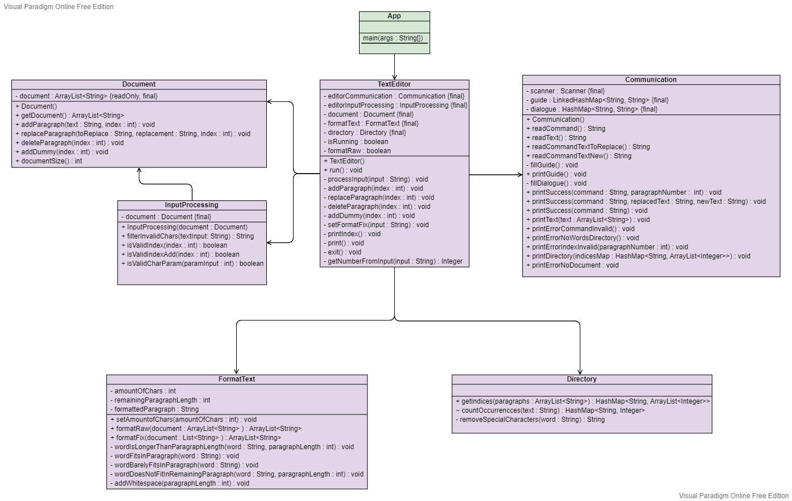

# Project 2: Text Editor

## Overview

This project is a simple text editor that allows you to edit your text via the terminal and apply any format on it. To use the text editor, first clone the project to your local directory and simply run the main method inside the App.java file and follow the instructions given in the terminal. The text editor was written in Java 17 and is compatible with up to Java 19. To see all the features and commands of this text editor, jump to [this section](#commands-and-features).

The project contains various JUnit tests to test the functionality and ensure that the program is working as intended. The JUnit version used in this project is `5.8.1`. The documentation for each test can be read inside the corresponding test class.

## Commands and features

The text editor supports the following commands:

* `ADD [n]`
* `DEL [n]`
* `DUMMY [n]`
* `EXIT`
* `FORMAT RAW`
* `FORMAT FIX <b>`
* `INDEX`
* `PRINT`
* `REPLACE [n]`

All the command names are in uppercase. The square bracket `[]` means that the argument inside it is optional. The angle bracket `<>` means that the argument inside it is required. The `n` stands for the paragraph number and can't be greater than the last paragraph of your text. Note that this program uses 1-based indexing. The `b` stands for the maximal line width (See [Format Fix](#format-fix)).

### ADD

This command lets the user add a new paragraph to your current text. By giving an integer as additional argument one can choose where the new paragraph is inserted. If no additional argument is given, then the new paragraph is inserted at the end of the text. After using this command, the program will ask for a text that is then inserted inside the current text.

### DEL

By using this command, the user can delete a paragraph from the current text. To choose the paragraph to be deleted, an index can be given as an additional argument. If no additional argument is given, then the last paragraph of the text is deleted.
 
### DUMMY

Using this command inserts a dummy paragraph at the given index in the current text. If no additional argument is given, then the dummy paragraph is inserted at the end of the text. The dummy is the ***Lorem Ipsum*** placeholder text.

### EXIT

This command shuts down the text editor. Note that the current text is not saved and will be lost after using this command.

### FORMAT RAW

This command sets the format of the text to the default one:
```
<1>: <text>
...
<n>: <text>
```

### FORMAT FIX

Using this command sets the format of the text to one where each paragraph has a maximal line width of `b` characters. Additionally, the new format has to satisfy the following conditions:

* New lines can only be inserted after a space.
* The space after which a new line is inserted does not count towards the line width.
* If there is no space within the maximal line width, then a new line can be inserted after the maximal line width.

Example:
```
FORMAT FIX 20
```

Current text
```
Virtute praecedunt, quod fere cotidianis proeliis cum 
Germanis contendunt, septentr ionesimmensoslongusw
ordos ionesimmensoslongusws.
```

Output
```
Virtute praecedunt,
quod fere cotidianis
proeliis cum
Germanis contendunt,
septentr
ionesimmensoslongusw
ordos
ionesimmensoslongusw
s.
```

### INDEX

This command prints all the terms that occur four or more times across all paragraphs. It shows the paragraph numbers where the term occurs. Only terms that start with an uppercase letter are considered and shown in the index. The terms are sorted in alphabetical order and paragraph numbers are sorted in ascending order.

Example: 
```
Baum 1,2,4
Haus 2,5
Person 1,2,3,5
```

### PRINT

This command prints the current text to the console. Note that the text is printed with the current set format.

### REPLACE

By using this command, the user can replace a part of a paragraph with a new text. To choose the paragraph to be replaced, an index can be given as an additional argument. If no additional argument is given, then the last paragraph of the text is replaced. After using this command, the program will first ask for a text that is replaced and then for a new text that replaces the old one.

## Class diagram

